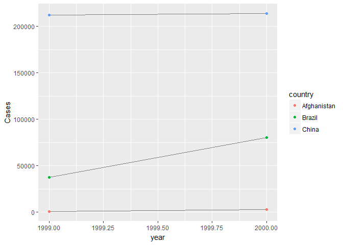

# Tidy_part1
Leonardo Jo  
June 14, 2017  


```r
## 12 Tidy Data
### 12.1 Introduction
library(tidyverse)
```

```
## Warning: package 'tidyverse' was built under R version 3.3.3
```

```
## Loading tidyverse: ggplot2
## Loading tidyverse: tibble
## Loading tidyverse: tidyr
## Loading tidyverse: readr
## Loading tidyverse: purrr
## Loading tidyverse: dplyr
```

```
## Warning: package 'ggplot2' was built under R version 3.3.3
```

```
## Warning: package 'tibble' was built under R version 3.3.3
```

```
## Warning: package 'tidyr' was built under R version 3.3.3
```

```
## Warning: package 'readr' was built under R version 3.3.3
```

```
## Warning: package 'purrr' was built under R version 3.3.3
```

```
## Warning: package 'dplyr' was built under R version 3.3.3
```

```
## Conflicts with tidy packages ----------------------------------------------
```

```
## filter(): dplyr, stats
## lag():    dplyr, stats
```

```r
### 12.2 Tidy data
table1
```

```
## # A tibble: 6 x 4
##       country  year  cases population
##         <chr> <int>  <int>      <int>
## 1 Afghanistan  1999    745   19987071
## 2 Afghanistan  2000   2666   20595360
## 3      Brazil  1999  37737  172006362
## 4      Brazil  2000  80488  174504898
## 5       China  1999 212258 1272915272
## 6       China  2000 213766 1280428583
```

```r
table2
```

```
## # A tibble: 12 x 4
##        country  year       type      count
##          <chr> <int>      <chr>      <int>
##  1 Afghanistan  1999      cases        745
##  2 Afghanistan  1999 population   19987071
##  3 Afghanistan  2000      cases       2666
##  4 Afghanistan  2000 population   20595360
##  5      Brazil  1999      cases      37737
##  6      Brazil  1999 population  172006362
##  7      Brazil  2000      cases      80488
##  8      Brazil  2000 population  174504898
##  9       China  1999      cases     212258
## 10       China  1999 population 1272915272
## 11       China  2000      cases     213766
## 12       China  2000 population 1280428583
```

```r
table3
```

```
## # A tibble: 6 x 3
##       country  year              rate
## *       <chr> <int>             <chr>
## 1 Afghanistan  1999      745/19987071
## 2 Afghanistan  2000     2666/20595360
## 3      Brazil  1999   37737/172006362
## 4      Brazil  2000   80488/174504898
## 5       China  1999 212258/1272915272
## 6       China  2000 213766/1280428583
```

```r
table4a
```

```
## # A tibble: 3 x 3
##       country `1999` `2000`
## *       <chr>  <int>  <int>
## 1 Afghanistan    745   2666
## 2      Brazil  37737  80488
## 3       China 212258 213766
```

```r
table4b
```

```
## # A tibble: 3 x 3
##       country     `1999`     `2000`
## *       <chr>      <int>      <int>
## 1 Afghanistan   19987071   20595360
## 2      Brazil  172006362  174504898
## 3       China 1272915272 1280428583
```

```r
# Compute rate per 10,000
table1 %>% 
  mutate(rate = cases / population * 10000)
```

```
## # A tibble: 6 x 5
##       country  year  cases population     rate
##         <chr> <int>  <int>      <int>    <dbl>
## 1 Afghanistan  1999    745   19987071 0.372741
## 2 Afghanistan  2000   2666   20595360 1.294466
## 3      Brazil  1999  37737  172006362 2.193930
## 4      Brazil  2000  80488  174504898 4.612363
## 5       China  1999 212258 1272915272 1.667495
## 6       China  2000 213766 1280428583 1.669488
```

```r
table1 %>% 
  count(year, wt = cases)
```

```
## # A tibble: 2 x 2
##    year      n
##   <int>  <int>
## 1  1999 250740
## 2  2000 296920
```

```r
table1 %>% 
  count(country, wt = cases)
```

```
## # A tibble: 3 x 2
##       country      n
##         <chr>  <int>
## 1 Afghanistan   3411
## 2      Brazil 118225
## 3       China 426024
```

```r
# Visualise changes over time
library(ggplot2)
ggplot(table1, aes(year, cases)) + 
  geom_line(aes(group = country), colour = "grey50") + 
  geom_point(aes(colour = country))
```

<!-- -->

```r
### 12.2.1 Exercises

#### Using prose, describe how the variables and observations are organised in each of the sample tables.

table1
```

```
## # A tibble: 6 x 4
##       country  year  cases population
##         <chr> <int>  <int>      <int>
## 1 Afghanistan  1999    745   19987071
## 2 Afghanistan  2000   2666   20595360
## 3      Brazil  1999  37737  172006362
## 4      Brazil  2000  80488  174504898
## 5       China  1999 212258 1272915272
## 6       China  2000 213766 1280428583
```

```r
table2
```

```
## # A tibble: 12 x 4
##        country  year       type      count
##          <chr> <int>      <chr>      <int>
##  1 Afghanistan  1999      cases        745
##  2 Afghanistan  1999 population   19987071
##  3 Afghanistan  2000      cases       2666
##  4 Afghanistan  2000 population   20595360
##  5      Brazil  1999      cases      37737
##  6      Brazil  1999 population  172006362
##  7      Brazil  2000      cases      80488
##  8      Brazil  2000 population  174504898
##  9       China  1999      cases     212258
## 10       China  1999 population 1272915272
## 11       China  2000      cases     213766
## 12       China  2000 population 1280428583
```

```r
table3
```

```
## # A tibble: 6 x 3
##       country  year              rate
## *       <chr> <int>             <chr>
## 1 Afghanistan  1999      745/19987071
## 2 Afghanistan  2000     2666/20595360
## 3      Brazil  1999   37737/172006362
## 4      Brazil  2000   80488/174504898
## 5       China  1999 212258/1272915272
## 6       China  2000 213766/1280428583
```

```r
table4a
```

```
## # A tibble: 3 x 3
##       country `1999` `2000`
## *       <chr>  <int>  <int>
## 1 Afghanistan    745   2666
## 2      Brazil  37737  80488
## 3       China 212258 213766
```

```r
table4b
```

```
## # A tibble: 3 x 3
##       country     `1999`     `2000`
## *       <chr>      <int>      <int>
## 1 Afghanistan   19987071   20595360
## 2      Brazil  172006362  174504898
## 3       China 1272915272 1280428583
```

```r
table5
```

```
## # A tibble: 6 x 4
##       country century  year              rate
## *       <chr>   <chr> <chr>             <chr>
## 1 Afghanistan      19    99      745/19987071
## 2 Afghanistan      20    00     2666/20595360
## 3      Brazil      19    99   37737/172006362
## 4      Brazil      20    00   80488/174504898
## 5       China      19    99 212258/1272915272
## 6       China      20    00 213766/1280428583
```

```r
#### Compute the rate for table2, and table4a + table4b. You will need to perform four operations:
  
##PART1
####  Extract the number of TB cases per country per year.
cases <- table2 %>%
  filter(type == "cases") %>%
  transmute(cases = count)
####  Extract the matching population per country per year.
population <- table2 %>%
  filter(type == "population") %>%
  transmute(population = count)
####  Divide cases by population, and multiply by 10000.
rate <- cases/population*10000

####  Store back in the appropriate place.
table2 %>%
  filter(type == "cases") %>%
  select(country, year) %>%
  mutate(Cases = unlist(cases)) %>%
  mutate(Population = unlist(population)) %>%
  mutate(rate = unlist(rate))
```

```
## # A tibble: 6 x 5
##       country  year  Cases Population     rate
##         <chr> <int>  <int>      <int>    <dbl>
## 1 Afghanistan  1999    745   19987071 0.372741
## 2 Afghanistan  2000   2666   20595360 1.294466
## 3      Brazil  1999  37737  172006362 2.193930
## 4      Brazil  2000  80488  174504898 4.612363
## 5       China  1999 212258 1272915272 1.667495
## 6       China  2000 213766 1280428583 1.669488
```

```r
####  Which representation is easiest to work with? Which is hardest? Why?

#### 3. Recreate the plot showing change in cases over time using table2 instead of table1. What do you need to do first?

table2 %>%
  filter(type == "cases") %>%
  select(country, year) %>%
  mutate(Cases = unlist(cases)) %>%
  mutate(Population = unlist(population)) %>%
  mutate(rate = unlist(rate)) %>%
  ggplot(aes(year, Cases)) + geom_line(aes(group = country), colour = "grey50") + 
  geom_point(aes(colour = country))
```

<!-- -->

```r
#### 12.3 Spreading and gathering

table4a
```

```
## # A tibble: 3 x 3
##       country `1999` `2000`
## *       <chr>  <int>  <int>
## 1 Afghanistan    745   2666
## 2      Brazil  37737  80488
## 3       China 212258 213766
```

```r
table4a %>% 
  gather(`1999`, `2000`, key = "year", value = "cases")
```

```
## # A tibble: 6 x 3
##       country  year  cases
##         <chr> <chr>  <int>
## 1 Afghanistan  1999    745
## 2      Brazil  1999  37737
## 3       China  1999 212258
## 4 Afghanistan  2000   2666
## 5      Brazil  2000  80488
## 6       China  2000 213766
```

```r
table4b %>% 
  gather(`1999`, `2000`, key = "year", value = "population")
```

```
## # A tibble: 6 x 3
##       country  year population
##         <chr> <chr>      <int>
## 1 Afghanistan  1999   19987071
## 2      Brazil  1999  172006362
## 3       China  1999 1272915272
## 4 Afghanistan  2000   20595360
## 5      Brazil  2000  174504898
## 6       China  2000 1280428583
```

```r
tidy4a <- table4a %>% 
  gather(`1999`, `2000`, key = "year", value = "cases")
tidy4b <- table4b %>% 
  gather(`1999`, `2000`, key = "year", value = "population")
left_join(tidy4a, tidy4b)
```

```
## Joining, by = c("country", "year")
```

```
## # A tibble: 6 x 4
##       country  year  cases population
##         <chr> <chr>  <int>      <int>
## 1 Afghanistan  1999    745   19987071
## 2      Brazil  1999  37737  172006362
## 3       China  1999 212258 1272915272
## 4 Afghanistan  2000   2666   20595360
## 5      Brazil  2000  80488  174504898
## 6       China  2000 213766 1280428583
```

```r
#### 12.3.2 Spreading

table2
```

```
## # A tibble: 12 x 4
##        country  year       type      count
##          <chr> <int>      <chr>      <int>
##  1 Afghanistan  1999      cases        745
##  2 Afghanistan  1999 population   19987071
##  3 Afghanistan  2000      cases       2666
##  4 Afghanistan  2000 population   20595360
##  5      Brazil  1999      cases      37737
##  6      Brazil  1999 population  172006362
##  7      Brazil  2000      cases      80488
##  8      Brazil  2000 population  174504898
##  9       China  1999      cases     212258
## 10       China  1999 population 1272915272
## 11       China  2000      cases     213766
## 12       China  2000 population 1280428583
```

```r
table2 %>%
  spread(key = type, value = count)
```

```
## # A tibble: 6 x 4
##       country  year  cases population
## *       <chr> <int>  <int>      <int>
## 1 Afghanistan  1999    745   19987071
## 2 Afghanistan  2000   2666   20595360
## 3      Brazil  1999  37737  172006362
## 4      Brazil  2000  80488  174504898
## 5       China  1999 212258 1272915272
## 6       China  2000 213766 1280428583
```

```r
spread(table2, key = type, value = count)
```

```
## # A tibble: 6 x 4
##       country  year  cases population
## *       <chr> <int>  <int>      <int>
## 1 Afghanistan  1999    745   19987071
## 2 Afghanistan  2000   2666   20595360
## 3      Brazil  1999  37737  172006362
## 4      Brazil  2000  80488  174504898
## 5       China  1999 212258 1272915272
## 6       China  2000 213766 1280428583
```

```r
#### 12.3.3 Exercises

#### 1. Why are gather() and spread() not perfectly symmetrical?
#### Carefully consider the following example:
  
stocks <- tibble(
    year   = c(2015, 2015, 2016, 2016),
    half  = c(   1,    2,     1,    2),
    return = c(1.88, 0.59, 0.92, 0.17)
  )

stocks
```

```
## # A tibble: 4 x 3
##    year  half return
##   <dbl> <dbl>  <dbl>
## 1  2015     1   1.88
## 2  2015     2   0.59
## 3  2016     1   0.92
## 4  2016     2   0.17
```

```r
stocks %>% 
  spread(year, return) 
```

```
## # A tibble: 2 x 3
##    half `2015` `2016`
## * <dbl>  <dbl>  <dbl>
## 1     1   1.88   0.92
## 2     2   0.59   0.17
```

```r
stocks %>% 
  spread(half, return) 
```

```
## # A tibble: 2 x 3
##    year   `1`   `2`
## * <dbl> <dbl> <dbl>
## 1  2015  1.88  0.59
## 2  2016  0.92  0.17
```

```r
stocks %>% 
  spread(half, return) %>%
  gather(`1`,`2`, key = "half", value = "return")
```

```
## # A tibble: 4 x 3
##    year  half return
##   <dbl> <chr>  <dbl>
## 1  2015     1   1.88
## 2  2016     1   0.92
## 3  2015     2   0.59
## 4  2016     2   0.17
```

```r
## Answer: Spread reduces the number of rows by combining variables

#### 2. Why does this code fail?

table4a %>% 
  gather(1999, 2000, key = "year", value = "cases")
```

```
## Error in combine_vars(vars, ind_list): Position must be between 0 and n
```

```r
#> Error in combine_vars(vars, ind_list): Position must be between 0 and n

table4a
```

```
## # A tibble: 3 x 3
##       country `1999` `2000`
## *       <chr>  <int>  <int>
## 1 Afghanistan    745   2666
## 2      Brazil  37737  80488
## 3       China 212258 213766
```

```r
table4a %>% 
  gather(`1999`, `2000`, key = "year", value = "cases")
```

```
## # A tibble: 6 x 3
##       country  year  cases
##         <chr> <chr>  <int>
## 1 Afghanistan  1999    745
## 2      Brazil  1999  37737
## 3       China  1999 212258
## 4 Afghanistan  2000   2666
## 5      Brazil  2000  80488
## 6       China  2000 213766
```

```r
## Answer: you need to add `` between names

### 4. Why does spreading this tibble fail? How could you add a new column to fix the problem?

people <- tribble(
  ~name,             ~key,    ~value,
  #-----------------|--------|------
  "Phillip Woods",   "age",       45,
  "Phillip Woods",   "height",   186,
  "Phillip Woods",   "age",       50,
  "Jessica Cordero", "age",       37,
  "Jessica Cordero", "height",   156
)

people
```

```
## # A tibble: 5 x 3
##              name    key value
##             <chr>  <chr> <dbl>
## 1   Phillip Woods    age    45
## 2   Phillip Woods height   186
## 3   Phillip Woods    age    50
## 4 Jessica Cordero    age    37
## 5 Jessica Cordero height   156
```

```r
people %>%
  spread(key = key, value = value)
```

```
## Error: Duplicate identifiers for rows (1, 3)
```

```r
## Answer: Error: Duplicate identifiers for rows (1, 3)

people2 <- tribble(
  ~name,             ~key,    ~value,
  #-----------------|--------|------
  "Phillip Woods",   "age",       45,
  "Phillip Woods",   "height",   186,
  "Jessica Cordero", "age",       37,
  "Jessica Cordero", "height",   156
)
people2
```

```
## # A tibble: 4 x 3
##              name    key value
##             <chr>  <chr> <dbl>
## 1   Phillip Woods    age    45
## 2   Phillip Woods height   186
## 3 Jessica Cordero    age    37
## 4 Jessica Cordero height   156
```

```r
people2 %>%
  spread(key = key, value = value)
```

```
## # A tibble: 2 x 3
##              name   age height
## *           <chr> <dbl>  <dbl>
## 1 Jessica Cordero    37    156
## 2   Phillip Woods    45    186
```

```r
### Tidy the simple tibble below. Do you need to spread or gather it? What are the variables?

preg <- tribble(
  ~pregnant, ~male, ~female,
  "yes",     NA,    10,
  "no",      20,    12
)
preg
```

```
## # A tibble: 2 x 3
##   pregnant  male female
##      <chr> <dbl>  <dbl>
## 1      yes    NA     10
## 2       no    20     12
```

```r
preg %>%
  gather(male,female, key = "gender", value = "cases")
```

```
## # A tibble: 4 x 3
##   pregnant gender cases
##      <chr>  <chr> <dbl>
## 1      yes   male    NA
## 2       no   male    20
## 3      yes female    10
## 4       no female    12
```

```r
### 12.4 Separating and uniting
#### 12.4.1 Separate

table3 ## Rate variable contain two variables
```

```
## # A tibble: 6 x 3
##       country  year              rate
## *       <chr> <int>             <chr>
## 1 Afghanistan  1999      745/19987071
## 2 Afghanistan  2000     2666/20595360
## 3      Brazil  1999   37737/172006362
## 4      Brazil  2000   80488/174504898
## 5       China  1999 212258/1272915272
## 6       China  2000 213766/1280428583
```

```r
table3 %>% 
  separate(rate, into = c("cases", "population")) ## Will separate numbers before and after nun-numerical character
```

```
## # A tibble: 6 x 4
##       country  year  cases population
## *       <chr> <int>  <chr>      <chr>
## 1 Afghanistan  1999    745   19987071
## 2 Afghanistan  2000   2666   20595360
## 3      Brazil  1999  37737  172006362
## 4      Brazil  2000  80488  174504898
## 5       China  1999 212258 1272915272
## 6       China  2000 213766 1280428583
```

```r
table3 %>% 
  separate(rate, into = c("cases", "population"), sep = "/") ## You can input separator
```

```
## # A tibble: 6 x 4
##       country  year  cases population
## *       <chr> <int>  <chr>      <chr>
## 1 Afghanistan  1999    745   19987071
## 2 Afghanistan  2000   2666   20595360
## 3      Brazil  1999  37737  172006362
## 4      Brazil  2000  80488  174504898
## 5       China  1999 212258 1272915272
## 6       China  2000 213766 1280428583
```

```r
table3 %>% 
  separate(rate, into = c("cases", "population"), convert = TRUE) ## Convert into
```

```
## # A tibble: 6 x 4
##       country  year  cases population
## *       <chr> <int>  <int>      <int>
## 1 Afghanistan  1999    745   19987071
## 2 Afghanistan  2000   2666   20595360
## 3      Brazil  1999  37737  172006362
## 4      Brazil  2000  80488  174504898
## 5       China  1999 212258 1272915272
## 6       China  2000 213766 1280428583
```

```r
table3 %>% 
  separate(year, into = c("century", "year"), sep = 2) ## numbers will separate the last digit
```

```
## # A tibble: 6 x 4
##       country century  year              rate
## *       <chr>   <chr> <chr>             <chr>
## 1 Afghanistan      19    99      745/19987071
## 2 Afghanistan      20    00     2666/20595360
## 3      Brazil      19    99   37737/172006362
## 4      Brazil      20    00   80488/174504898
## 5       China      19    99 212258/1272915272
## 6       China      20    00 213766/1280428583
```

```r
table3 %>% 
  separate(year, into = c("century", "year"), sep = 3) ## numbers will separate the last digit
```

```
## # A tibble: 6 x 4
##       country century  year              rate
## *       <chr>   <chr> <chr>             <chr>
## 1 Afghanistan     199     9      745/19987071
## 2 Afghanistan     200     0     2666/20595360
## 3      Brazil     199     9   37737/172006362
## 4      Brazil     200     0   80488/174504898
## 5       China     199     9 212258/1272915272
## 6       China     200     0 213766/1280428583
```

```r
### 12.4.2 Unite

table5
```

```
## # A tibble: 6 x 4
##       country century  year              rate
## *       <chr>   <chr> <chr>             <chr>
## 1 Afghanistan      19    99      745/19987071
## 2 Afghanistan      20    00     2666/20595360
## 3      Brazil      19    99   37737/172006362
## 4      Brazil      20    00   80488/174504898
## 5       China      19    99 212258/1272915272
## 6       China      20    00 213766/1280428583
```

```r
table5 %>% 
  unite(new, century, year) #unite columns century and year into new column called new
```

```
## # A tibble: 6 x 3
##       country   new              rate
## *       <chr> <chr>             <chr>
## 1 Afghanistan 19_99      745/19987071
## 2 Afghanistan 20_00     2666/20595360
## 3      Brazil 19_99   37737/172006362
## 4      Brazil 20_00   80488/174504898
## 5       China 19_99 212258/1272915272
## 6       China 20_00 213766/1280428583
```

```r
table5 %>% 
  unite(new, century, year, sep ="") #specifies separation between two arguments
```

```
## # A tibble: 6 x 3
##       country   new              rate
## *       <chr> <chr>             <chr>
## 1 Afghanistan  1999      745/19987071
## 2 Afghanistan  2000     2666/20595360
## 3      Brazil  1999   37737/172006362
## 4      Brazil  2000   80488/174504898
## 5       China  1999 212258/1272915272
## 6       China  2000 213766/1280428583
```

```r
### 12.4.3 Exercises

### 1. What do the extra and fill arguments do in separate()? Experiment with the various options for the following two toy datasets.
?separate()
```

```
## starting httpd help server ...
```

```
##  done
```

```r
##Extra = too many pieces
tibble(x = c("a,b,c", "d,e,f,g", "h,i,j")) %>% 
  separate(x, c("one", "two", "three"))
```

```
## Warning: Too many values at 1 locations: 2
```

```
## # A tibble: 3 x 3
##     one   two three
## * <chr> <chr> <chr>
## 1     a     b     c
## 2     d     e     f
## 3     h     i     j
```

```r
tibble(x = c("a,b,c", "d,e,f,g", "h,i,j")) %>% 
  separate(x, c("one", "two", "three"), extra = "drop")
```

```
## # A tibble: 3 x 3
##     one   two three
## * <chr> <chr> <chr>
## 1     a     b     c
## 2     d     e     f
## 3     h     i     j
```

```r
##Fill = Missing pieces
tibble(x = c("a,b,c", "d,e", "f,g,i")) %>% 
  separate(x, c("one", "two", "three"))
```

```
## Warning: Too few values at 1 locations: 2
```

```
## # A tibble: 3 x 3
##     one   two three
## * <chr> <chr> <chr>
## 1     a     b     c
## 2     d     e  <NA>
## 3     f     g     i
```

```r
tibble(x = c("a,b,c", "d,e", "f,g,i")) %>% 
  separate(x, c("one", "two", "three"), fill = "right")
```

```
## # A tibble: 3 x 3
##     one   two three
## * <chr> <chr> <chr>
## 1     a     b     c
## 2     d     e  <NA>
## 3     f     g     i
```

```r
### 2. Both unite() and separate() have a remove argument. What does it do? Why would you set it to FALSE?

tibble(x = c("a,b,c", "d,e,f", "f,g,i")) %>% 
  separate(x, c("one", "two", "three"), remove = F) ## Remove the original tibble, default = T
```

```
## # A tibble: 3 x 4
##       x   one   two three
## * <chr> <chr> <chr> <chr>
## 1 a,b,c     a     b     c
## 2 d,e,f     d     e     f
## 3 f,g,i     f     g     i
```

```r
### 3. Compare and contrast separate() and extract(). Why are there three variations of separation (by position, by separator, and with groups), but only one unite?
?extract()
table3
```

```
## # A tibble: 6 x 3
##       country  year              rate
## *       <chr> <int>             <chr>
## 1 Afghanistan  1999      745/19987071
## 2 Afghanistan  2000     2666/20595360
## 3      Brazil  1999   37737/172006362
## 4      Brazil  2000   80488/174504898
## 5       China  1999 212258/1272915272
## 6       China  2000 213766/1280428583
```

```r
table3 %>% 
  separate(rate, into = c("cases", "population"))
```

```
## # A tibble: 6 x 4
##       country  year  cases population
## *       <chr> <int>  <chr>      <chr>
## 1 Afghanistan  1999    745   19987071
## 2 Afghanistan  2000   2666   20595360
## 3      Brazil  1999  37737  172006362
## 4      Brazil  2000  80488  174504898
## 5       China  1999 212258 1272915272
## 6       China  2000 213766 1280428583
```
