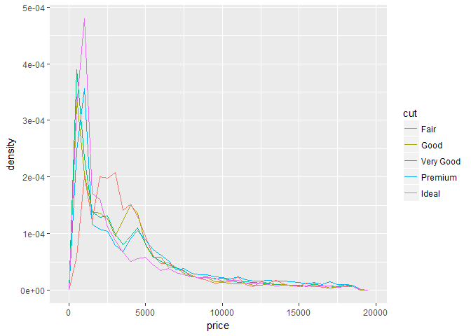
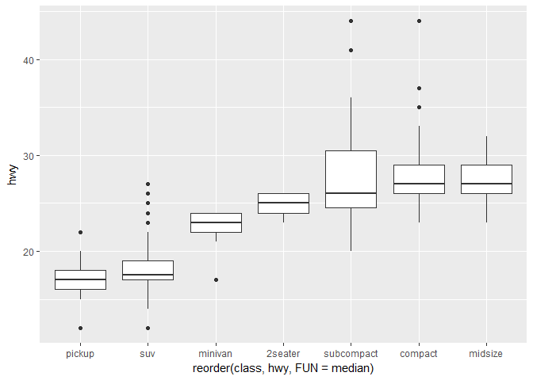

    ## Chapter 7 -> Exploratory-data-analysi

    #7.1.1 -> Prerequisites
    library(tidyverse)

    ## Loading tidyverse: ggplot2
    ## Loading tidyverse: tibble
    ## Loading tidyverse: tidyr
    ## Loading tidyverse: readr
    ## Loading tidyverse: purrr
    ## Loading tidyverse: dplyr

    ## Conflicts with tidy packages ----------------------------------------------

    ## filter(): dplyr, stats
    ## lag():    dplyr, stats

    library(devtools)
    library(ggstance)

    ## 
    ## Attaching package: 'ggstance'

    ## The following objects are masked from 'package:ggplot2':
    ## 
    ##     geom_errorbarh, GeomErrorbarh

    multiplot <- function(..., plotlist=NULL, file, cols=1, layout=NULL) {
      library(grid)
      
      # Make a list from the ... arguments and plotlist
      plots <- c(list(...), plotlist)
      
      numPlots = length(plots)
      
      # If layout is NULL, then use 'cols' to determine layout
      if (is.null(layout)) {
        # Make the panel
        # ncol: Number of columns of plots
        # nrow: Number of rows needed, calculated from # of cols
        layout <- matrix(seq(1, cols * ceiling(numPlots/cols)),
                         ncol = cols, nrow = ceiling(numPlots/cols))
      }
      
      if (numPlots==1) {
        print(plots[[1]])
        
      } else {
        # Set up the page
        grid.newpage()
        pushViewport(viewport(layout = grid.layout(nrow(layout), ncol(layout))))
        
        # Make each plot, in the correct location
        for (i in 1:numPlots) {
          # Get the i,j matrix positions of the regions that contain this subplot
          matchidx <- as.data.frame(which(layout == i, arr.ind = TRUE))
          
          print(plots[[i]], vp = viewport(layout.pos.row = matchidx$row,
                                          layout.pos.col = matchidx$col))
        }
      }
    }

    #7.3.1 -> Visualising distributions

    ## Categorical Values
    ggplot(data = diamonds) +
      geom_bar(aes(x=cut)) ## The heigt of the bars displays how many observations occurred with each x value. You can compute these values manually with dplyr:count()

    diamonds %>% count(cut)

    ## # A tibble: 5 × 2
    ##         cut     n
    ##       <ord> <int>
    ## 1      Fair  1610
    ## 2      Good  4906
    ## 3 Very Good 12082
    ## 4   Premium 13791
    ## 5     Ideal 21551

    ## Continuous values
    ggplot(data= diamonds) +
      geom_histogram(aes(x=carat), bindwidth = 0.5)

    ## Warning: Ignoring unknown parameters: bindwidth

    ## `stat_bin()` using `bins = 30`. Pick better value with `binwidth`.

    diamonds %>% count(cut_width(carat, 0.5))

    ## # A tibble: 11 × 2
    ##    `cut_width(carat, 0.5)`     n
    ##                     <fctr> <int>
    ## 1             [-0.25,0.25]   785
    ## 2              (0.25,0.75] 29498
    ## 3              (0.75,1.25] 15977
    ## 4              (1.25,1.75]  5313
    ## 5              (1.75,2.25]  2002
    ## 6              (2.25,2.75]   322
    ## 7              (2.75,3.25]    32
    ## 8              (3.25,3.75]     5
    ## 9              (3.75,4.25]     4
    ## 10             (4.25,4.75]     1
    ## 11             (4.75,5.25]     1

    smaller <- diamonds %>% filter(carat < 3)
    ggplot(smaller, aes(x=carat)) +
      geom_histogram(binwidth = 0.1)

    ggplot(smaller, aes(x=carat)) +
      geom_histogram(binwidth = 0.2)

    ## Overlapping histograms -> geom_freqpoly

    ggplot(smaller, aes(x=carat, colour = cut)) +
      geom_freqpoly(bindwidth=0.1)

    ## Warning: Ignoring unknown parameters: bindwidth

    ## `stat_bin()` using `bins = 30`. Pick better value with `binwidth`.

    ## 7.3.2 Typical values
    ggplot(smaller, aes(x=carat)) +
      geom_histogram(binwidth = 0.01)

    ggplot(faithful, aes(x=eruptions)) +
      geom_histogram(binwidth = 0.25)

    ## TO SEE OUTLIERS
    ggplot(diamonds) + geom_histogram(aes(x=y), binwidth = 0.5) + coord_cartesian(ylim=c(0,50)) ## inserting limits to the cartesian coordinates

    unusual <- diamonds %>% filter(y<3 | y>20) %>% select(price, x,y,z) %>% arrange(y)
    unusual

    ## # A tibble: 9 × 4
    ##   price     x     y     z
    ##   <int> <dbl> <dbl> <dbl>
    ## 1  5139  0.00   0.0  0.00
    ## 2  6381  0.00   0.0  0.00
    ## 3 12800  0.00   0.0  0.00
    ## 4 15686  0.00   0.0  0.00
    ## 5 18034  0.00   0.0  0.00
    ## 6  2130  0.00   0.0  0.00
    ## 7  2130  0.00   0.0  0.00
    ## 8  2075  5.15  31.8  5.12
    ## 9 12210  8.09  58.9  8.06

    diamonds

    ## # A tibble: 53,940 × 10
    ##    carat       cut color clarity depth table price     x     y     z
    ##    <dbl>     <ord> <ord>   <ord> <dbl> <dbl> <int> <dbl> <dbl> <dbl>
    ## 1   0.23     Ideal     E     SI2  61.5    55   326  3.95  3.98  2.43
    ## 2   0.21   Premium     E     SI1  59.8    61   326  3.89  3.84  2.31
    ## 3   0.23      Good     E     VS1  56.9    65   327  4.05  4.07  2.31
    ## 4   0.29   Premium     I     VS2  62.4    58   334  4.20  4.23  2.63
    ## 5   0.31      Good     J     SI2  63.3    58   335  4.34  4.35  2.75
    ## 6   0.24 Very Good     J    VVS2  62.8    57   336  3.94  3.96  2.48
    ## 7   0.24 Very Good     I    VVS1  62.3    57   336  3.95  3.98  2.47
    ## 8   0.26 Very Good     H     SI1  61.9    55   337  4.07  4.11  2.53
    ## 9   0.22      Fair     E     VS2  65.1    61   337  3.87  3.78  2.49
    ## 10  0.23 Very Good     H     VS1  59.4    61   338  4.00  4.05  2.39
    ## # ... with 53,930 more rows

    ## 7.3.4 Exercises

    ### 1. Explore the distribution of each x, y and z variables in diamnods. What do you Learn?
    p <- ggplot(diamonds)

    ## X Histogram
    p + geom_histogram(aes(x=x), binwidth = 0.01)

    ## X outliers
    p + geom_histogram(aes(x=x), binwidth = 0.01) + coord_cartesian (ylim=c(0,50))

    ## Y Histogram
    p + geom_histogram(aes(x=y), binwidth = 0.01)

    ## Y outliers
    p + geom_histogram(aes(x=y), binwidth = 0.01) + coord_cartesian (ylim=c(0,50))

    ## Z Histogram
    p + geom_histogram(aes(x=z), binwidth = 0.01)

    ## Z outliers
    p + geom_histogram(aes(x=z), binwidth = 0.01) + coord_cartesian (ylim=c(0,50))

    p + 
      geom_freqpoly(aes(x=x), binwidth = 0.01, color = "red") +
      geom_freqpoly(aes(x=y), binwidth = 0.01, color = "blue") +
      geom_freqpoly(aes(x=z), binwidth = 0.01, color = "green") + 
      coord_cartesian(xlim=c(0,10))

    ## Answer: Since X = Y, most likely X and Y refers to length and width, Z is different so it refers to depth

    ### 2. Explore the distribution of price. Do you discover anything unusual or surprising?

    p + 
      geom_histogram(aes(x=price), binwidth = 100)

    p + 
      geom_freqpoly(aes(x=price, colour = cut), binwidth = 100)

    ### 3. How many diamonds are 0.99 carat? How many are 1 carat? What do you think is the cause of the difference

    diamonds %>% filter(carat == 0.99 | carat == 1) %>% count(carat)

    ## # A tibble: 2 × 2
    ##   carat     n
    ##   <dbl> <int>
    ## 1  0.99    23
    ## 2  1.00  1558

    ### 4. Compare and contrast coord_cartesian() vs xlim() or ylim when zooming in on a histogram

    p + 
      geom_histogram(aes(x=price), binwidth = 100) + coord_cartesian(ylim=c(0,50))

    p + 
      geom_histogram(aes(x=price), binwidth = 100) + ylim(0,50)

    ## Warning: Removed 145 rows containing missing values (geom_bar).

    ## Answer: Ylim remove all values that don't fall into the ylim coordinates

    ## 7.4 Missing values : What to do when you encounter unusual values?

    ## Removing outliers
    diamonds2 <- diamonds %>% filter(between(y,3,20))

    ## Replacing outliers with missing values
    diamonds2 <- diamonds %>% mutate(y = ifelse(y<3 | y>20, NA, y))
    ### ifelse has three arguments , first logical (TRUE or FALSE), second contains the value, third is what argument to add when it is false

    ## 7.4.1 - Exercises

    ### 1. What happens to missing values in a histogram? What happens to missing values in a bar chart? Why is there a difference?

    diamonds3 <- diamonds %>% mutate(y=ifelse(y<5 | y>20, NA, y))

    ggplot(diamonds3) + geom_histogram(aes(x=y), binwidth = 0.1)

    ## Warning: Removed 17573 rows containing non-finite values (stat_bin).

    ggplot(diamonds3) + geom_bar(aes(x=y))

    ## Warning: Removed 17573 rows containing non-finite values (stat_count).

    ## no differences

    ### 2. What does na.rm = Ture do in mean() and sum()?

    mean(diamonds3$y)

    ## [1] NA

    mean(diamonds3$y, na.rm = T)

    ## [1] 6.329503

    sum(diamonds3$y, na.rm = T)

    ## [1] 230185

    diamonds3 %>% 
      group_by(cut) %>% 
      summarize(mean = mean(y, na.rm=T), mean2 = mean(y), sum= sum(y, na.rm = T), sum2=sum(y))

    ## # A tibble: 5 × 5
    ##         cut     mean mean2      sum  sum2
    ##       <ord>    <dbl> <dbl>    <dbl> <dbl>
    ## 1      Fair 6.366834    NA  9149.14    NA
    ## 2      Good 6.293376    NA 23342.13    NA
    ## 3 Very Good 6.316574    NA 54044.61    NA
    ## 4   Premium 6.524872    NA 63826.30    NA
    ## 5     Ideal 6.195982    NA 79822.84    NA

    #7.5 Covariation

    ## Covariation is the tendency for the values of two or more variables to vary together in a related way. 
    ## Comparing between shapes
    ggplot(data = diamonds, mapping = aes(x = price)) + 
      geom_freqpoly(mapping = aes(colour = cut), binwidth = 500)

    ## Groups with different numbers, hard to compare
    ggplot(diamonds) + 
      geom_bar(mapping = aes(x = cut))

    ## How to address this problem? STANDARDIZE
    ggplot(data = diamonds, mapping = aes(x = price, y = ..density..)) + ## y= ..density.. means proportion to the total
      geom_freqpoly(mapping = aes(colour = cut), binwidth = 500) 

    ## Boxplot

    ggplot(data = diamonds, mapping = aes(x = cut, y = price)) +
      geom_boxplot()

    ## Reorder
    ggplot(data = mpg, mapping = aes(x = class, y = hwy)) +
      geom_boxplot()

    ggplot(data = mpg) +
      geom_boxplot(mapping = aes(x = reorder(class, hwy, FUN = median), y = hwy)) ## Reordering X Class (categorical values), by Y, function= MEAN!

    ## Flipping the plot
    ggplot(data = mpg) +
      geom_boxplot(mapping = aes(x = reorder(class, hwy, FUN = median), y = hwy)) +
      coord_flip()

    ## 7.5.1.1 Exercises

    ### 1. Use what you’ve learned to improve the visualisation of the departure times of cancelled vs. non-cancelled flights.
    library(nycflights13)
    flights.status <- mutate(flights, STATUS = ifelse(is.na(dep_delay) & is.na(arr_delay), "Cancelled", "Not Cancelled"))

    ggplot(data = flights.status) +
      geom_boxplot(mapping = aes(x = STATUS, y = sched_dep_time)) ## Reordering X Class (categorical values), by Y, function= MEAN!

    ## Answer: Cancelled Flights Afternoon/Evening

    ### 2. What variable in the diamonds dataset is most important for predicting the price of a diamond? How is that variable correlated with cut? Why does the combination of those two relationships lead to lower quality diamonds being more expensive?

    ggplot(data = diamonds) +
      geom_freqpoly(aes(x = price, y = ..density.., colour = clarity), binwidth = 100)

    ggplot(data = diamonds) +
      geom_freqpoly(aes(x = price, y = ..density.., colour = color), binwidth = 100)

    ggplot(data = diamonds) +
      geom_freqpoly(aes(x = price, y = ..density.., colour = cut), binwidth = 100) +
      geom_freqpoly(aes(x = price, y = ..density.., colour = clarity), binwidth = 100) +
      geom_freqpoly(aes(x = price, y = ..density.., colour = color), binwidth = 100)

    ### 3. Install the ggstance package, and create a horizontal boxplot. How does this compare to using coord_flip()?
    install.packages("devtools")

    ## Installing package into 'C:/Users/Main Account/Documents/R/win-library/3.3'
    ## (as 'lib' is unspecified)

    ## Warning: package 'devtools' is in use and will not be installed

    devtools::install_github("lionel-/ggstance")

    ## Skipping install of 'ggstance' from a github remote, the SHA1 (7007b096) has not changed since last install.
    ##   Use `force = TRUE` to force installation

    ggplot(data = flights.status) +
      geom_boxplot(mapping = aes(x = STATUS, y = sched_dep_time)) +
      coord_flip()

    ggplot(data = flights.status) +
      geom_boxploth(mapping = aes(y = STATUS, x = sched_dep_time))

    ### 4. One problem with boxplots is that they were developed in an era of much smaller datasets and tend to display a prohibitively large number of “outlying values”. One approach to remedy this problem is the letter value plot. Install the lvplot package, and try using geom_lv() to display the distribution of price vs cut. What do you learn? How do you interpret the plots?
    install.packages("lvplot")

    ## Installing package into 'C:/Users/Main Account/Documents/R/win-library/3.3'
    ## (as 'lib' is unspecified)

    ## package 'lvplot' successfully unpacked and MD5 sums checked
    ## 
    ## The downloaded binary packages are in
    ##  C:\Users\Main Account\AppData\Local\Temp\Rtmp02uQ6k\downloaded_packages

    library(lvplot)

    ggplot(data = diamonds) +
      geom_lv(mapping = aes(x = cut, y = price))

    ## Error: GeomLv was built with an incompatible version of ggproto.
    ## Please reinstall the package that provides this extension.

    ### 5. Compare and contrast geom_violin() with a facetted geom_histogram(), or a coloured geom_freqpoly(). What are the pros and cons of each method?
    a <- ggplot(data = diamonds) +
      geom_violin(mapping = aes(x = cut, y = price))
    plot(a)

    b <- ggplot(data = diamonds) +
      geom_histogram(mapping = aes(x = price, y=..density..), binwidth = 100) +
      facet_wrap(~cut, ncol=1)
    plot(b)  

    c <- ggplot(data = diamonds) +
      geom_freqpoly(mapping = aes(x = price, y =..density.., colour = cut), binwidth = 100)
    plot(c)

    multiplot(a, b, c, cols=1)

    ### 6. If you have a small dataset, it’s sometimes useful to use geom_jitter() to see the relationship between a continuous and categorical variable. The ggbeeswarm package provides a number of methods similar to geom_jitter(). List them and briefly describe what each one does.

    install.packages("ggbeeswarm")

    ## Installing package into 'C:/Users/Main Account/Documents/R/win-library/3.3'
    ## (as 'lib' is unspecified)

    ## package 'ggbeeswarm' successfully unpacked and MD5 sums checked
    ## 
    ## The downloaded binary packages are in
    ##  C:\Users\Main Account\AppData\Local\Temp\Rtmp02uQ6k\downloaded_packages

    library(ggbeeswarm)

    ggplot(data = diamonds) +
      geom_jitter(aes(x = price, y =cut))

    ggplot(data = diamonds) +
      geom_beeswarm(aes(x = price, y =cut))

    ## Error: PositionBeeswarm was built with an incompatible version of ggproto.
    ## Please reinstall the package that provides this extension.

    ## PositionBeeswarm was built with an incompatible version of ggproto.
    ## Please reinstall the package that provides this extension.

    ## 7.5.2 Categorical numbers

    ggplot(data = diamonds) +
      geom_count(mapping = aes(x = cut, y = color))

    diamonds %>% 
      count(color, cut)

    ## Source: local data frame [35 x 3]
    ## Groups: color [?]
    ## 
    ##    color       cut     n
    ##    <ord>     <ord> <int>
    ## 1      D      Fair   163
    ## 2      D      Good   662
    ## 3      D Very Good  1513
    ## 4      D   Premium  1603
    ## 5      D     Ideal  2834
    ## 6      E      Fair   224
    ## 7      E      Good   933
    ## 8      E Very Good  2400
    ## 9      E   Premium  2337
    ## 10     E     Ideal  3903
    ## # ... with 25 more rows

    diamonds %>% 
      count(color, cut) %>%  
      ggplot(mapping = aes(x = color, y = cut)) +
      geom_tile(mapping = aes(fill = n))

    ## 7.5.2.1 Exercises

    ## How could you rescale the count dataset above to more clearly show the distribution of cut within colour, or colour within cut?

    ## Remove ""outliers""?
    a <- diamonds %>% 
      count(color, cut) %>%  
      filter(n, n < 2000) %>%
      ggplot(mapping = aes(x = color, y = cut)) +
      geom_tile(mapping = aes(fill = n))
    plot(a)

    ## NO!

    b<- diamonds %>% 
      count(color, cut) %>%  
      ggplot(mapping = aes(x = color, y = cut)) +
      geom_tile(mapping = aes(fill = n)) +
      scale_fill_gradient(limits=c(-0, 2000))
    plot(b)

    ## NO!

    c <-diamonds %>% 
      count(color, cut) %>%  
      ggplot(mapping = aes(x = color, y = cut)) +
      geom_tile(mapping = aes(fill = n)) +
      scale_fill_gradient(limits = c(0,2000), low = "blue", high = "yellow", labels= c(0,500,1000,1500,"2000 or more"), breaks= seq(0,2000, by=500), na.value = "yellow") 
    plot(c)

    ## Use geom_tile() together with dplyr to explore how average flight delays vary by destination and month of year. What makes the plot difficult to read? How could you improve it?
    flights %>% 
      group_by(dest, month) %>%
      summarise(Flight_delay = mean(arr_delay)) %>%
      ggplot() +
      geom_tile(aes(x=month, y= dest, group = cut_width(month,5)))

    ## Why is it slightly better to use aes(x = color, y = cut) rather than aes(x = cut, y = color) in the example above?

    a <- diamonds %>% 
      count(color, cut) %>%  
      ggplot(mapping = aes(x = color, y = cut)) +
      geom_tile(mapping = aes(fill = n))

    b <- diamonds %>% 
      count(color, cut) %>%  
      ggplot(mapping = aes(x = cut, y = color)) +
      geom_tile(mapping = aes(fill = n))

    multiplot(a,b)

    ## 7.5.3 Continuous values

    ggplot(data = diamonds) +
      geom_point(mapping = aes(x = carat, y = price))

    ggplot(data = diamonds) + 
      geom_point(mapping = aes(x = carat, y = price), alpha = 1 / 100)

    ## Creating bins for continuous values!!!!
    ggplot(data = smaller) +
      geom_bin2d(mapping = aes(x = carat, y = price))

    #install.packages("hexbin")
    ggplot(data = smaller) +
      geom_hex(mapping = aes(x = carat, y = price))

    ggplot(data = smaller, mapping = aes(x = carat, y = price)) + 
      geom_boxplot(mapping = aes(group = cut_width(carat, 0.1)))

    ## to show specific number of bins  -> cut_number (how many bins)
    ggplot(data = smaller, mapping = aes(x = carat, y = price)) + 
      geom_boxplot(mapping = aes(group = cut_number(carat, 20)))

    ## 7.5.3.1 Exercises

    ### 1. Instead of summarising the conditional distribution with a boxplot, you could use a frequency polygon. What do you need to consider when using cut_width() vs cut_number()? How does that impact a visualisation of the 2d distribution of carat and price?
    ggplot(data = smaller, mapping = aes(x = carat, y = price)) + 
      geom_boxplot(mapping = aes(group = cut_width(carat, 0.1)))

    ggplot(data = smaller) + 
      geom_freqpoly(aes(x= price, y =..density.., colors = carat, group = cut_width(carat, 0.1)), binwidth= 500)

    ## Warning: Ignoring unknown aesthetics: colors

    ggplot(data = smaller) + 
      geom_freqpoly(aes(x=price, y =..density.., colour = carat ,group = cut_number(carat, 20)), binwidth= 500)

    ### 2. Visualise the distribution of carat, partitioned by price.

    ggplot(data = smaller) + 
      geom_freqpoly(aes(x= price, y =..density.., colors = carat, group = cut_width(carat, 0.1)), binwidth= 500)

    ## Warning: Ignoring unknown aesthetics: colors

    ## How to add colors to specific bins?

    ### 3. How does the price distribution of very large diamonds compare to small diamonds. Is it as you expect, or does it surprise you?

    ggplot(data = diamonds) + 
      geom_freqpoly(aes(x= price, y =..density.., colors = x, group = cut_width(x, 0.1)), binwidth= 500)

    ## Warning: Ignoring unknown aesthetics: colors

    ### 4. Combine two of the techniques you’ve learned to visualise the combined distribution of cut, carat, and price.

    ggplot(data = diamonds) + 
      geom_freqpoly(aes(x= price, y =..density.., colors = x, group = cut_width(x, 0.1)), binwidth= 500)

    ## Warning: Ignoring unknown aesthetics: colors

    ### 5. Two dimensional plots reveal outliers that are not visible in one dimensional plots. For example, some points in the plot below have an unusual combination of x and y values, which makes the points outliers even though their x and y values appear normal when examined separately.

    multiplot <- function(..., plotlist=NULL, file, cols=1, layout=NULL) {
      library(grid)
      
      # Make a list from the ... arguments and plotlist
      plots <- c(list(...), plotlist)
      
      numPlots = length(plots)
      
      # If layout is NULL, then use 'cols' to determine layout
      if (is.null(layout)) {
        # Make the panel
        # ncol: Number of columns of plots
        # nrow: Number of rows needed, calculated from # of cols
        layout <- matrix(seq(1, cols * ceiling(numPlots/cols)),
                         ncol = cols, nrow = ceiling(numPlots/cols))
      }
      
      if (numPlots==1) {
        print(plots[[1]])
        
      } else {
        # Set up the page
        grid.newpage()
        pushViewport(viewport(layout = grid.layout(nrow(layout), ncol(layout))))
        
        # Make each plot, in the correct location
        for (i in 1:numPlots) {
          # Get the i,j matrix positions of the regions that contain this subplot
          matchidx <- as.data.frame(which(layout == i, arr.ind = TRUE))
          
          print(plots[[i]], vp = viewport(layout.pos.row = matchidx$row,
                                          layout.pos.col = matchidx$col))
        }
      }
    }
