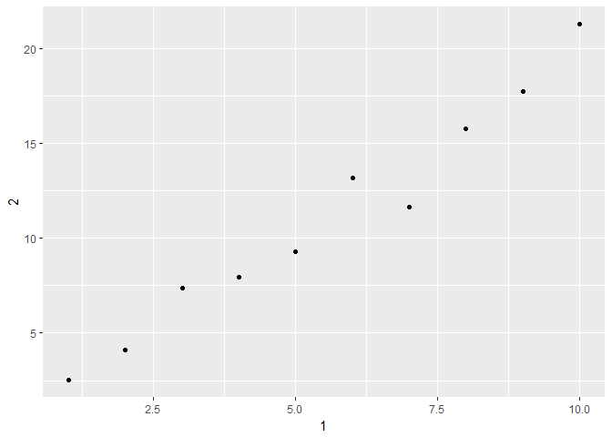

    library(tidyverse)

    ## Loading tidyverse: ggplot2
    ## Loading tidyverse: tibble
    ## Loading tidyverse: tidyr
    ## Loading tidyverse: readr
    ## Loading tidyverse: purrr
    ## Loading tidyverse: dplyr

    ## Conflicts with tidy packages ----------------------------------------------

    ## filter(): dplyr, stats
    ## lag():    dplyr, stats

    library(dplyr)
    ## 10.5 Exercises

    ### 1. How can you tell if an object is a tibble?

    mtcars

    ##                      mpg cyl  disp  hp drat    wt  qsec vs am gear carb
    ## Mazda RX4           21.0   6 160.0 110 3.90 2.620 16.46  0  1    4    4
    ## Mazda RX4 Wag       21.0   6 160.0 110 3.90 2.875 17.02  0  1    4    4
    ## Datsun 710          22.8   4 108.0  93 3.85 2.320 18.61  1  1    4    1
    ## Hornet 4 Drive      21.4   6 258.0 110 3.08 3.215 19.44  1  0    3    1
    ## Hornet Sportabout   18.7   8 360.0 175 3.15 3.440 17.02  0  0    3    2
    ## Valiant             18.1   6 225.0 105 2.76 3.460 20.22  1  0    3    1
    ## Duster 360          14.3   8 360.0 245 3.21 3.570 15.84  0  0    3    4
    ## Merc 240D           24.4   4 146.7  62 3.69 3.190 20.00  1  0    4    2
    ## Merc 230            22.8   4 140.8  95 3.92 3.150 22.90  1  0    4    2
    ## Merc 280            19.2   6 167.6 123 3.92 3.440 18.30  1  0    4    4
    ## Merc 280C           17.8   6 167.6 123 3.92 3.440 18.90  1  0    4    4
    ## Merc 450SE          16.4   8 275.8 180 3.07 4.070 17.40  0  0    3    3
    ## Merc 450SL          17.3   8 275.8 180 3.07 3.730 17.60  0  0    3    3
    ## Merc 450SLC         15.2   8 275.8 180 3.07 3.780 18.00  0  0    3    3
    ## Cadillac Fleetwood  10.4   8 472.0 205 2.93 5.250 17.98  0  0    3    4
    ## Lincoln Continental 10.4   8 460.0 215 3.00 5.424 17.82  0  0    3    4
    ## Chrysler Imperial   14.7   8 440.0 230 3.23 5.345 17.42  0  0    3    4
    ## Fiat 128            32.4   4  78.7  66 4.08 2.200 19.47  1  1    4    1
    ## Honda Civic         30.4   4  75.7  52 4.93 1.615 18.52  1  1    4    2
    ## Toyota Corolla      33.9   4  71.1  65 4.22 1.835 19.90  1  1    4    1
    ## Toyota Corona       21.5   4 120.1  97 3.70 2.465 20.01  1  0    3    1
    ## Dodge Challenger    15.5   8 318.0 150 2.76 3.520 16.87  0  0    3    2
    ## AMC Javelin         15.2   8 304.0 150 3.15 3.435 17.30  0  0    3    2
    ## Camaro Z28          13.3   8 350.0 245 3.73 3.840 15.41  0  0    3    4
    ## Pontiac Firebird    19.2   8 400.0 175 3.08 3.845 17.05  0  0    3    2
    ## Fiat X1-9           27.3   4  79.0  66 4.08 1.935 18.90  1  1    4    1
    ## Porsche 914-2       26.0   4 120.3  91 4.43 2.140 16.70  0  1    5    2
    ## Lotus Europa        30.4   4  95.1 113 3.77 1.513 16.90  1  1    5    2
    ## Ford Pantera L      15.8   8 351.0 264 4.22 3.170 14.50  0  1    5    4
    ## Ferrari Dino        19.7   6 145.0 175 3.62 2.770 15.50  0  1    5    6
    ## Maserati Bora       15.0   8 301.0 335 3.54 3.570 14.60  0  1    5    8
    ## Volvo 142E          21.4   4 121.0 109 4.11 2.780 18.60  1  1    4    2

    class(mtcars)[1]

    ## [1] "data.frame"

    class(as_tibble(mtcars))[1]

    ## [1] "tbl_df"

    ### 2. Compare and contrast the following operations on a data.frame and equivalent tibble. What is different? Why might the default data frame behaviours cause you frustration?

    df <- data.frame(abc = 1, xyz = "a")
    df

    ##   abc xyz
    ## 1   1   a

    df$xyz

    ## [1] a
    ## Levels: a

    df$xy

    ## [1] a
    ## Levels: a

    df[, "xyz"]

    ## [1] a
    ## Levels: a

    df[, c("abc", "xyz")]

    ##   abc xyz
    ## 1   1   a

    #data.frame treats columns like factors

    df <- tibble(abc = 1, xyz ="a")
    df

    ## # A tibble: 1 × 2
    ##     abc   xyz
    ##   <dbl> <chr>
    ## 1     1     a

    df$xyz

    ## [1] "a"

    df[, "xyz"]

    ## # A tibble: 1 × 1
    ##     xyz
    ##   <chr>
    ## 1     a

    #tibble don't treat columns like factors

    var <- "mpg"
    df <- tibble('abc' = c(1,2), 'xyz' = c("mpg","xxx"))
    df

    ## # A tibble: 2 × 2
    ##     abc   xyz
    ##   <dbl> <chr>
    ## 1     1   mpg
    ## 2     2   xxx

    df %>% as_tibble() %>%
      filter(xyz, xyz == var)

    ## Error in eval(substitute(expr), envir, enclos): operations are possible only for numeric, logical or complex types

    subset(df, xyz == var)

    ## # A tibble: 1 × 2
    ##     abc   xyz
    ##   <dbl> <chr>
    ## 1     1   mpg

    annoying <- tibble(
      `1` = 1:10,
      `2` = `1` * 2 + rnorm(length(`1`))
    )

    ## Practice referring to non-syntactic names in the following data frame by:
    ## Extracting the variable called 1.

    annoying %>% filter(`1`, `1` == 1)

    ## # A tibble: 1 × 2
    ##     `1`      `2`
    ##   <int>    <dbl>
    ## 1     1 2.536092

    ## Plotting a scatterplot of 1 vs 2.

    ggplot(annoying) +
      geom_point(aes(`1`,`2`))

    ## Creating a new column called 3 which is 2 divided by 1.

    annoying <- annoying %>% 
      mutate(`3`= `2`/`1`)

    ## Renaming the columns to one, two and three.

    annoying %>%
      rename(`1` = `one`,`2`= `two`,`3`= `three`)

    ## Error: Unknown variables: one, two, three.

    names(annoying) <- c("one", "two", "three")

    annoying

    ## # A tibble: 10 × 3
    ##      one       two    three
    ##    <int>     <dbl>    <dbl>
    ## 1      1  2.536092 2.536092
    ## 2      2  4.090479 2.045240
    ## 3      3  7.358023 2.452674
    ## 4      4  7.927113 1.981778
    ## 5      5  9.302127 1.860425
    ## 6      6 13.192351 2.198725
    ## 7      7 11.633674 1.661953
    ## 8      8 15.764515 1.970564
    ## 9      9 17.747445 1.971938
    ## 10    10 21.264756 2.126476

    ## 5. What does tibble::enframe() do? When might you use it?
      
    ## Creates a tibble from atomic vectors of two clomuns 
    ??enframe

    ## starting httpd help server ...

    ##  done

    tibble::enframe(annoying, c("name","value","mean"))

    ## Error: Each variable must be a 1d atomic vector or list.
    ## Problem variables: 'unname(x)'

    enframe(1:3)

    ## # A tibble: 3 × 2
    ##    name value
    ##   <int> <int>
    ## 1     1     1
    ## 2     2     2
    ## 3     3     3

    enframe(c(a = 5, b = 7))

    ## # A tibble: 2 × 2
    ##    name value
    ##   <chr> <dbl>
    ## 1     a     5
    ## 2     b     7

    enframe(annoying)

    ## Error: Each variable must be a 1d atomic vector or list.
    ## Problem variables: 'unname(x)'

    enframe(c(a = 1+1,b = 2+2))

    ## # A tibble: 2 × 2
    ##    name value
    ##   <chr> <dbl>
    ## 1     a     2
    ## 2     b     4

    ## What option controls how many additional column names are printed at the footer of a tibble?

    annoying

    ## # A tibble: 10 × 3
    ##      one       two    three
    ##    <int>     <dbl>    <dbl>
    ## 1      1  2.536092 2.536092
    ## 2      2  4.090479 2.045240
    ## 3      3  7.358023 2.452674
    ## 4      4  7.927113 1.981778
    ## 5      5  9.302127 1.860425
    ## 6      6 13.192351 2.198725
    ## 7      7 11.633674 1.661953
    ## 8      8 15.764515 1.970564
    ## 9      9 17.747445 1.971938
    ## 10    10 21.264756 2.126476
